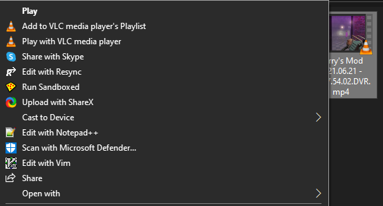

# Resync-Edit

Resync-Edit is a program which helps you trim your videos. It's primarily meant for use by people who use programs like Nvidia Instant Replay, and AMD ReLive.

Resync-Edit is meant as a FOSS alternative to the Windows Movie Editor, allowing people to instantly trim videos, while NOT Re-Encoding them.

## Features
- Library with all of your clips which are instantly searchable
- Ability to trim videos in under a second
- Right click "Edit with Resync" menu, allowing you to quickly edit any video from the file explorer.

## Getting Started
Prerequisites
- You must have Windows 10 1803 or newer.
- Dotnet Core 5.0 is required.

If you want to download it, head over to the [releases](https://github.com/Nevin1901/Resync-Edit/releases) page.

If you see "Windows Protected Your PC" while running the installer, just click "More Info", and then "Run Anyway". The reason you see this error is because not enough people have installed Resync-Edit for Windows to know it's not a virus.

If you want to build Resync-Edit from source, follow these steps:
* `git clone https://github.com/Nevin1901/Resync-Edit.git`
* Open it in Visual Studio
* Restore all NuGet Packages
* Build All

## Libraries Used
- [FFMPeg](https://ffmpeg.org/)
- [FFME.Windows](https://github.com/unosquare/ffmediaelement)
- [FFMPegCore](https://github.com/rosenbjerg/FFMpegCore)
- [Microsoft.Toolkit.Uwp.Notifications](https://github.com/CommunityToolkit/WindowsCommunityToolkit)
- [ModernWpfUI](https://github.com/Kinnara/ModernWpf)
- [Newtonsoft.Json](https://github.com/Kinnara/ModernWpf)
- [Prism.Unity](https://github.com/PrismLibrary/Prism)
- [InnoSetup](https://jrsoftware.org/isinfo.php)

Thanks to all the great people behind these libraries. The project would not be possible without them.

## Todo
- Add "upload to YouTube" feature
- Add right click context menu in library
- Make the "encode videos" feature save videos in higher quality
- Add support for more file types
- Make library index clips in base folder

## Bugs
- Loading bar clips through screen whenever you change folder location

Puri Chapman Software, 2021
